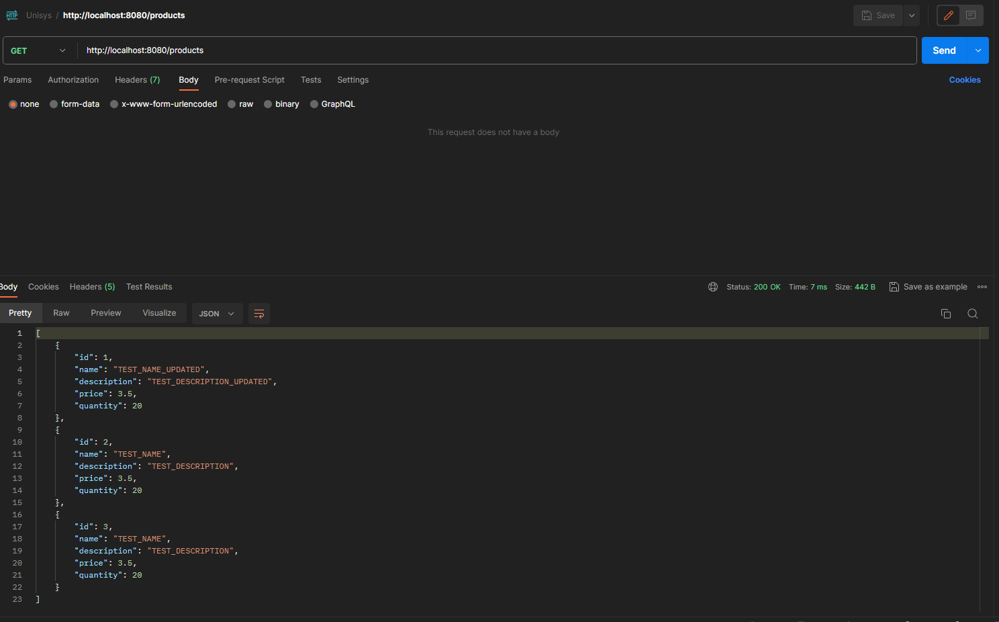
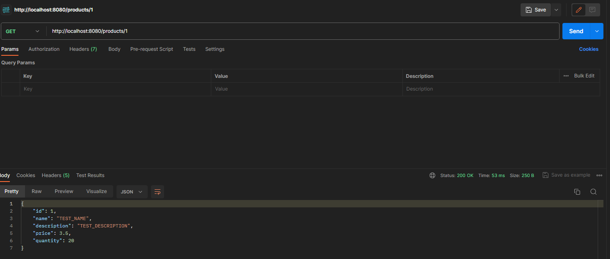
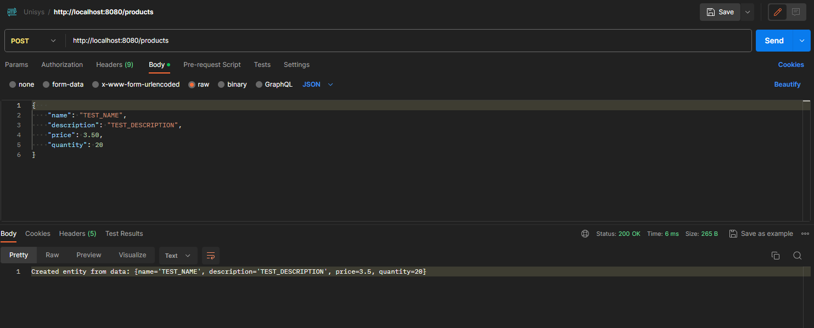
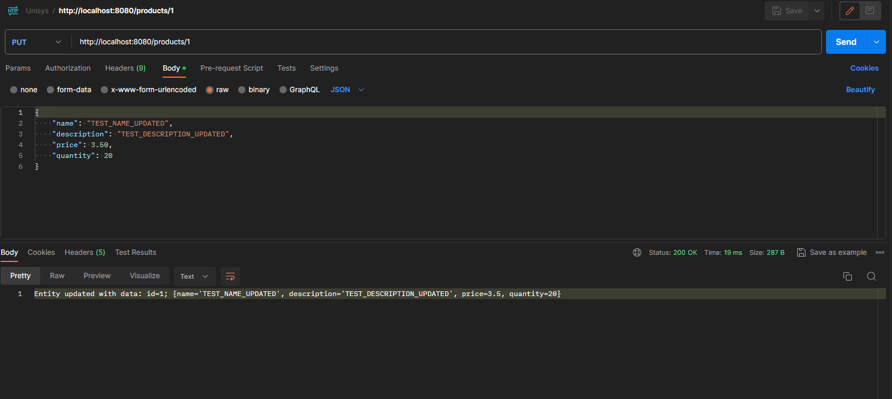
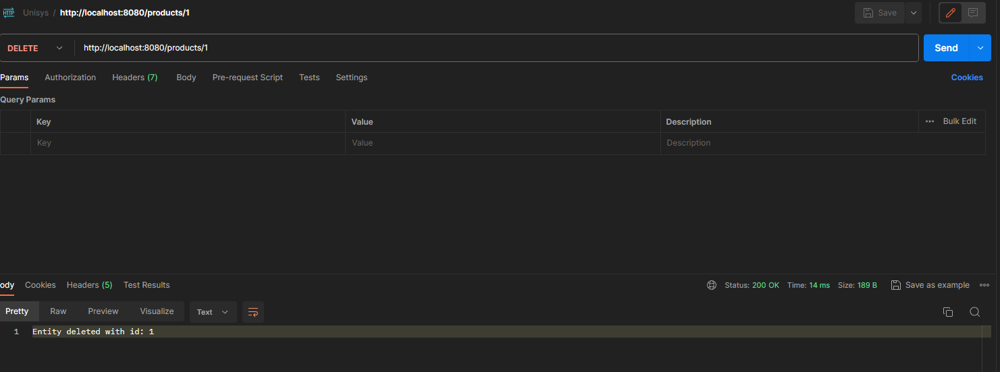

# UNISYS - PRODUCT DEMO

## CONTENTS
1) Project Description
2) Example Postman API Calls

### 1) Project description
This project is created on basing the provided task presented
in file: 
``Take-Home Test for Java API Developer.docx``

I've decided to create simple project using basic spring boot
extensions like:

* Spring Web
* Spring Data JPA
* Lombok
* Validation
* Security (authentication is basic in application.properties)
* Mapstruct (added externally)

I've created simple tree structure of the project, according 
to programming patterns, which consists of several packages
with different spring components.

Project consists of repository, service, and controller to access data.
I've also created DTO to access data from endpoints (according to best practices).
DTO is mapped via Mapstruct Mapper (implementation generated on runtime).
DTO is Validated with Spring Boot Validation extension (basic validation).
Critical info is logged with SLF4J (simple logs)

Project allows end users to manage basic CRUD operations on Product entity.

### 2) Example Postman API Calls

* Example of Http get method /products (I've used same data besides id):

* Example of Http GET method with path variable /products/{id}:

* Example of Http POST method /products :

* Example of Http PUT method with path variable id /products/{id} :

* Example of Http DELETE method /products:

All endpoint are documented in OpenApi :
``ProductDemo-openapi.yaml``

Project could be run locally with IDE (Intellij) or just by downloading
jar ``ProductDemo-0.0.1-SNAPSHOT.jar`` and running it locally on machine.

Project uses maven so to run test just run ``mvn test``